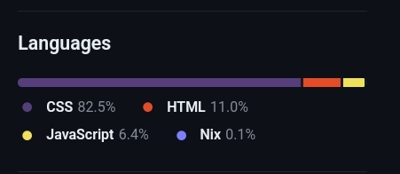

# cookie.clicker
hello fellows
i have made a cookie clicker!!! ive been working on this for a  while, but only now decided to connect to git
so now this is open source yayayayayayayyaya
feel free to fork this on replit or get some code from the git, but __please credit me though__
 
 
also if you check the git, thats a surprising amount of CSS (probably outdated)
 
